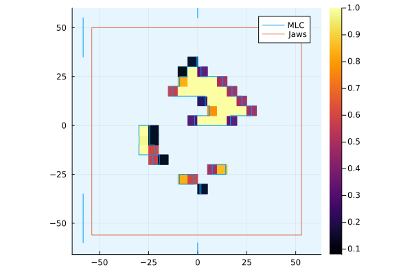

# RoentgenPlots.jl

RoentgenPlots.jl provides functions to plot datatypes defined in [Roentgen.jl](https://github.com/Image-X-Institute/Roentgen.jl) using [Plots.jl](https://docs.juliaplots.org).

RoentgenPlots.jl provides two methods for plotting beam-limiting device positions `plot_bld` and `plot_bld!` functions:

- `plot_bld(bld::AbstractBeamLimitingDevice; kwargs...)` takes beam-limiting device types as defined in Roentgen.jl and plots them on a new figure
- `plot_bld!([p,] bld::AbstractBeamLimitingDevice; kwargs...)` adds beam-limiting device plots to existing figures

Following the notation used in Plots.jl, `plot_bld` creates a new figure, while `plot_bld!` adds to an existing plot (which can be specified by providing `p`).
